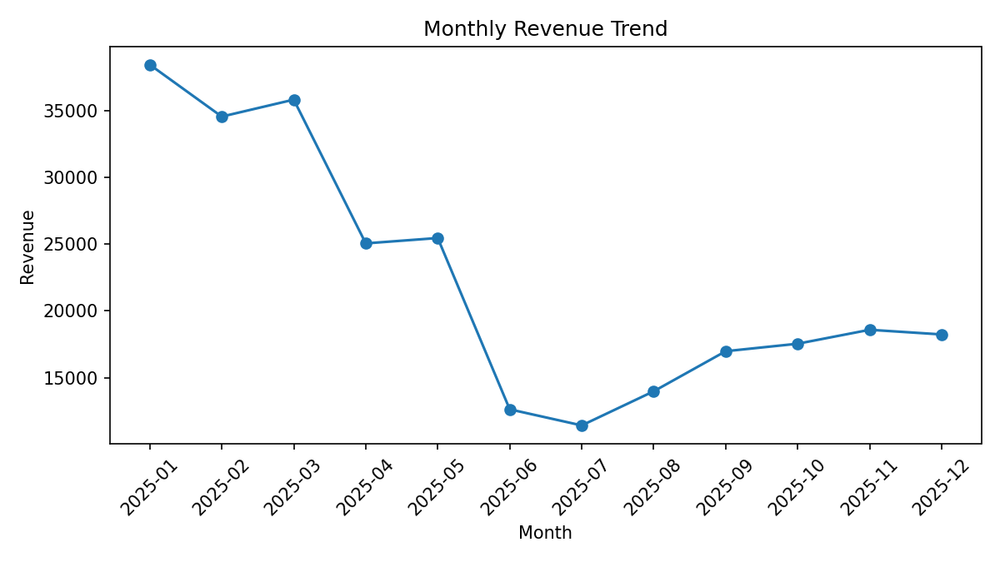

# Retail Reporting Automation

Python pipeline for analysts and operators who need **repeatable retail KPI packs** — cleaned data, charts, an Excel workbook, and a PowerPoint deck — without manual spreadsheet busywork.

## Problem → approach → result

| | |
| --- | --- |
| **Problem** | Weekly retail reporting is slow, error-prone, and hard to reproduce when it lives only in Excel. |
| **Approach** | A deterministic Python pipeline: load/validate CSV → transform → compute insights → export charts, `.xlsx`, and `.pptx`. Fake data generation is built in so the full path runs with no private data. |
| **Result** | One command produces `report.xlsx`, `report.pptx`, and chart PNGs under `data/output/`. |



## Stack

Python · pandas · openpyxl / xlsxwriter · python-pptx · matplotlib

## Quick start

```bash
python3 -m venv .venv
source .venv/bin/activate
pip install -r requirements.txt
python run_report.py --force-generate
```

## Outputs

After execution, check:

- `data/input/retail.csv` (generated if missing or forced)
- `data/output/report.xlsx`
- `data/output/report.pptx`
- `data/output/charts/*.png`

## Use your own dataset

Your CSV should include: `date`, `region`, `category`, `product`, `units`, `revenue`.

```bash
python run_report.py --input data/input/my_retail.csv --output data/output
```

## Repo layout

```text
retail-reporting-automation/
  data/input/          # input CSVs (fake data generated on demand)
  data/output/         # Excel, PowerPoint, charts
  docs/                # architecture + LinkedIn writeup
  src/                 # pipeline, loaders, exports, viz
  tests/               # smoke tests
  run_report.py        # CLI entrypoint
  requirements.txt
```

See also: [`docs/ARCHITECTURE.md`](docs/ARCHITECTURE.md).

## Tests

```bash
pip install pytest
python -m pytest tests/ -q
```

## License

MIT — see [`LICENSE`](LICENSE).

## Contact

[LinkedIn](https://www.linkedin.com/in/adityadabrase/) · [dabrase.a@gmail.com](mailto:dabrase.a@gmail.com)
